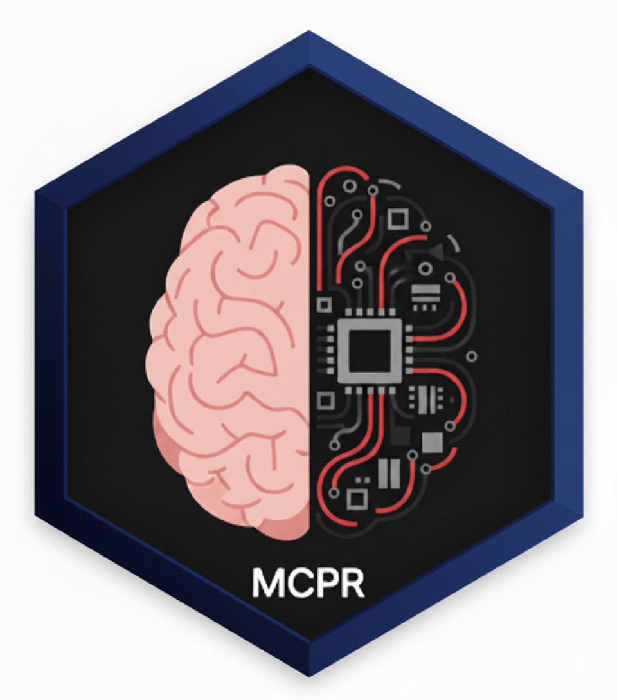

<!-- README.md is generated from README.Rmd. Please edit that file -->

```{r, include = FALSE}
knitr::opts_chunk$set(
  collapse = TRUE,
  comment = "#>",
  fig.path = "man/figures/README-",
  out.width = "100%"
)
```

# MCPR: A Practical Framework for Stateful Human-AI Collaboration in R 

<!-- badges: start -->
[](https://lifecycle.r-lib.org/articles/stages.html#experimental)
[](https://github.com/phisanti/MCPR/actions/workflows/R-CMD-check.yaml)
[](https://app.codecov.io/gh/phisanti/MCPR?branch=main)
[](https://github.com/phisanti/MCPR/releases)
<!-- badges: end -->

The MCPR (Model Context Protocol Tools for R) package addresses a fundamental limitation in the current paradigm of AI-assisted R programming. Existing AI agents operate in a stateless execution model, invoking `Rscript` for each command, which is antithetical to the iterative, state-dependent nature of serious data analysis. An analytical workflow is a cumulative process of exploration, modelling, and validation that can span hours or days. Moreover, intermediate steps can involve heavy computation, and small changes in downstream code such as plot aesthetics require running the entire script again. MCPR aims to tackle this issue by enabling AI agents to establish persistent, interactive sessions within a live R environment, thereby preserving workspace state and enabling complex, multi-step analytical workflows.

## Quick Start

Get up and running with MCPR in under 2 minutes:

```r
# 1. Install MCPR
remotes::install_github("phisanti/MCPR")

# 2. Start an R session and make it discoverable
library(MCPR)
mcpr_session()

# 3. In your AI agent (Claude, etc.), connect to the session
# The agent will use: manage_r_sessions("list") then manage_r_sessions("join", session_id)

# 4. Now your AI agent can run R code in your live session!
# Example: execute_r_code("summary(mtcars)")
```

**That's it!** Your AI agent can now execute R code, create plots, and inspect your workspace while preserving all session state.

## Core capabilities

MCPR's design is guided by principles of modularity, robustness, and practicality.

- **Communication Protocol:** MCPR uses JSON-RPC 2.0 over `nanonext` sockets, providing a lightweight, asynchronous, and reliable messaging layer. This choice ensures cross-platform compatibility and non-blocking communication suitable for an interactive environment.
- **Tool-Based Design:** Functionality is exposed to the AI agent as a discrete set of tools (create_plot, execute_r_code, etc.). This modular approach simplifies the agent's interaction logic and provides clear, well-defined endpoints for R operations.
- **Session Management:** A central `mcpr_session()` function acts as a listener, making an R session discoverable on the local machine. The `manage_r_sessions` tool provides the service discovery mechanism for agents to find and connect to these listeners.
- **Graphics Subsystem:** Plot generation leverages `httpgd` when available for high-performance, off-screen rendering. A fallback to standard R graphics devices (grDevices) ensures broad compatibility. The system includes intelligent token management to prevent oversized image payloads.

## Installation
The first requirement is to have R installed and then install the MCPR package from GitHub:

```r
if (!require("remotes")) install.packages("remotes")

remotes::install_github("phisanti/MCPR")
```

Next, you should install the MCP server to give the agent access to the tools included in the package. System integration is designed to be straightforward, with both automated and manual pathways.

### Automated Setup
A convenience function, `install_mcpr()`, is provided to handle package installation and agent-specific MCP configuration.

```r
library(MCPR)
install_mcpr(agent = "claude") # Supported agents: 'claude', 'gemini', 'copilot'
```
### Manual MCP Configuration

For Claude Desktop, configure `claude_desktop_config.json`. You can likely find it in one of these locations depending on your OS:

**macOS**: `~/Library/Application Support/Claude/claude_desktop_config.json`
**Windows**: `%APPDATA%\Claude\claude_desktop_config.json`
**Linux**: `~/.config/claude/claude_desktop_config.json`

Then, add the following MCP server configuration:
```json
{
  "mcpServers": {
    "mcpr": {
      "command": "Rscript",
      "args": ["-e", "MCPR::mcp_server()"],
      "env": {
        "R_LIBS_USER": "/path/to/your/R/library"
      }
    }
  }
}
```
## Usage Pattern
The intended workflow is simple and user-centric.

1. The user starts an R session and invokes `mcpr_session()` to enable connections.
2. The user instructs their AI agent to connect.
3. The agent uses `manage_r_sessions('list')` to find the session ID and `manage_r_sessions('join', session=ID)` to connect.
4. The user can now interact with the agent, making requests regarding their R session. The agent can now use `execute_r_code`, `create_plot`, and `view` to collaboratively assist the user with their analysis, maintaining full context throughout the interaction.

## Agent tools
The philosophy in the development of the MCPR package is to provide the agent with few, well-defined tools that can be composed to perform complex tasks. The goal was to give the agent the ability to manage multiple R sessions (`manage_r_sessions`), to run R code in the session (`execute_r_code`), see the graphical data (`create_plot`), and inspect the session (`view`). We believe these are flexible enough to accomplish any task in R. See the details below.

### `execute_r_code(code)`
**Purpose**: Execute arbitrary R code within session context
**Input**: Character string containing R expressions
**Output**: Structured response with results, output, warnings, and errors
  
```r
execute_r_code("
  library(dplyr)
  data <- mtcars %>% 
    filter(mpg > 20) %>%
    select(mpg, cyl, wt)
  nrow(data)
")
```

### `create_plot(expr, width, height, format)`
**Purpose**: Generate visualizations with AI-optimized output
**Input**: R plotting expression, dimensions, format specification
**Output**: Base64-encoded image with metadata and token usage information

```r
create_plot("
  library(ggplot2)
  ggplot(mtcars, aes(wt, mpg)) + 
    geom_point() + 
    geom_smooth(method = 'lm')
", width = 600, height = 450)
```

### `manage_r_sessions(action, session)`
**Purpose**: Session discovery and management
**Actions**: 
- `"list"`: Enumerate active sessions with metadata
- `"join"`: Connect to specific session by ID
- `"start"`: Launch new R session process

```r
manage_r_sessions("list")        # Show available sessions
manage_r_sessions("join", 2)     # Connect to session 2
manage_r_sessions("start")       # Create new session
```

### `view(what, max_lines)`
**Purpose**: Environment introspection and debugging
**what**:
- `'session'`: Object summaries with statistical metadata
- `'terminal'`: Command history for workflow reproducibility
- `'workspace'`: File system context
- `'installed_packages'`: Available libraries

## Common errors
- **Connection Failed:** Ensure `mcpr_session()` is running in R. Set the `MCPTOOLS_LOG_FILE` environment variable to a valid path and inspect logs for detailed error messages.
- **Tools Not Found:** Confirm the path in `user_mcp.json` is correct and that the agent has been restarted. Manually install the MCP server to verify the setup.
- **Plotting Errors:** Ensure the plotting expression is valid and that all necessary libraries are loaded, and install `httpgd`.

If these issues persist, please open an issue on the GitHub repository with relevant logs and context.

---

This project is licensed under the Creative Commons Attribution 4.0 International License.