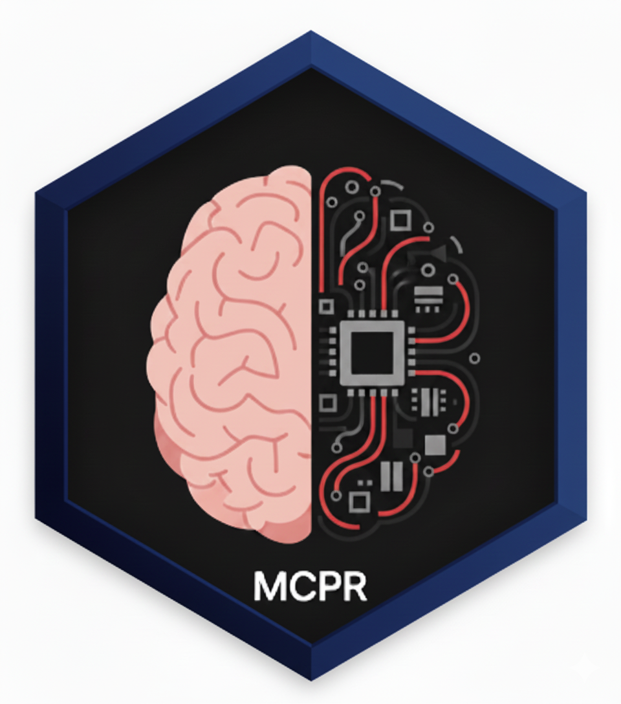
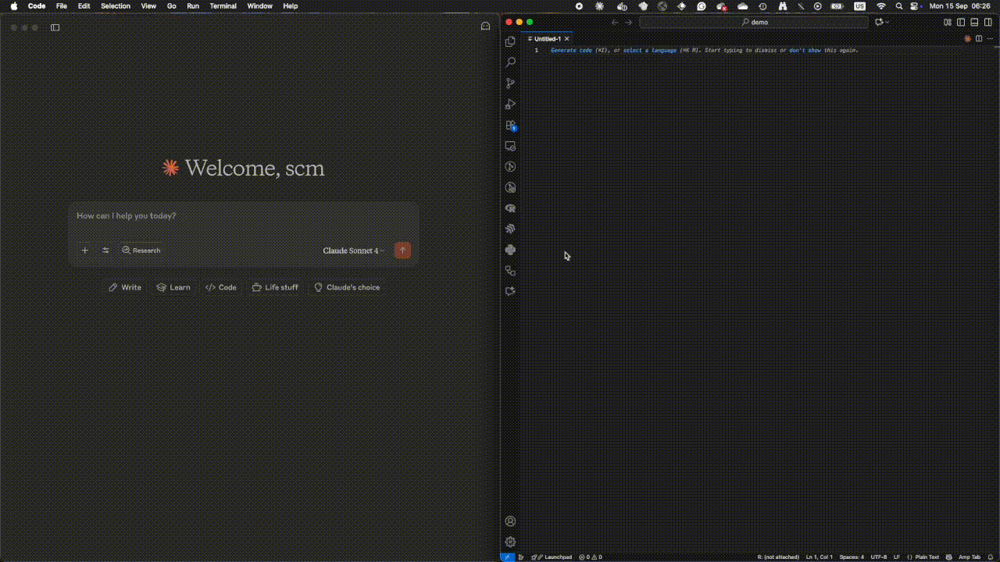

<!-- README.md is generated from README.Rmd. Please edit that file -->

# MCPR: A Practical Framework for Stateful Human-AI Collaboration in R <a href="https://phisanti.github.io/MCPR/" alt="MCPR"></a>

<!-- badges: start -->

[](https://lifecycle.r-lib.org/articles/stages.html#experimental)
[](https://github.com/phisanti/MCPR/actions/workflows/R-CMD-check.yaml)
[](https://app.codecov.io/gh/phisanti/MCPR?branch=main)
[](https://github.com/phisanti/MCPR/releases)
<!-- badges: end -->

The MCPR (Model Context Protocol Tools for R) package addresses a
fundamental limitation in the current paradigm of AI-assisted R
programming. Existing AI agents operate in a stateless execution model,
invoking `Rscript` for each command, which is antithetical to the
iterative, state-dependent nature of serious data analysis. An
analytical workflow is a cumulative process of exploration, modelling,
and validation that can span hours or days. Moreover, intermediate steps
can involve heavy computation, and small changes in downstream code such
as plot aesthetics require running the entire script again. MCPR aims to
tackle this issue by enabling AI agents to establish persistent,
interactive sessions within a live R environment, thereby preserving
workspace state and enabling complex, multi-step analytical workflows.

<figure>

<figcaption aria-hidden="true">MCPR Demo</figcaption>
</figure>

## Quick Start

Get up and running with MCPR in under 2 minutes:

``` r
# 1. Install MCPR
remotes::install_github("phisanti/MCPR")

# 2. Configure your AI agent to launch the MCPR server
library(MCPR)
install_mcpr(agent = "claude")

# 3. In your AI agent (Claude, etc.), start using MCPR tools
# MCPR::mcpr_server() is the agent's private R session by default

# 4. Optionally attach to a live R session with manage_r_sessions()
# Example: execute_r_code("summary(mtcars)")
```

**That’s it!** Your AI agent can execute R code, create plots, and
inspect a persistent private workspace. If you want the agent to work
inside an existing interactive R session, run `mcpr_session_start()`
there and attach with `manage_r_sessions()`.

## Core capabilities

MCPR’s design is guided by principles of modularity, robustness, and
practicality.

- **Communication Protocol:** MCPR uses JSON-RPC 2.0 over `nanonext`
  sockets, providing a lightweight, asynchronous, and reliable messaging
  layer. This choice ensures cross-platform compatibility and
  non-blocking communication suitable for an interactive environment.
- **Tool-Based Design:** Functionality is exposed to the AI agent as a
  discrete set of tools (show_plot, execute_r_code, etc.). This modular
  approach simplifies the agent’s interaction logic and provides clear,
  well-defined endpoints for R operations.
- **Session Management:** The MCP server process is a private R session
  by default. The optional `manage_r_sessions` tool can list attachable
  sessions, join a human session started with `mcpr_session_start()`,
  start a secondary session, detach back to private/local execution, or
  close MCPR-owned secondary sessions.
- **Graphics Subsystem:** Plot generation leverages `httpgd` when
  available for high-performance, off-screen rendering. A fallback to
  standard R graphics devices (grDevices) ensures broad compatibility.
  The system includes intelligent token management to prevent oversized
  image payloads.

## Installation

The first requirement is to have R installed and then install the MCPR
package from GitHub:

``` r
if (!require("remotes")) install.packages("remotes")

remotes::install_github("phisanti/MCPR")
```

Next, you should install the MCP server to give the agent access to the
tools included in the package. System integration is designed to be
straightforward, with both automated and manual pathways.

### Automated Setup

A convenience function, `install_mcpr()`, is provided to handle package
installation and agent-specific MCP configuration. Supported agents
include Claude, Gemini, Copilot, and Codex.

``` r
library(MCPR)
install_mcpr(agent = "claude") # Supported agents: 'claude', 'gemini', 'copilot', 'codex'
```

### Manual MCP Configuration

For Claude Desktop, configure `claude_desktop_config.json`. You can
likely find it in one of these locations depending on your OS:

**macOS**:
`~/Library/Application Support/Claude/claude_desktop_config.json`
**Windows**: `%APPDATA%\Claude\claude_desktop_config.json` **Linux**:
`~/.config/claude/claude_desktop_config.json`

Then, add the following MCP server configuration:

``` json
{
  "mcpServers": {
    "mcpr": {
      "command": "R",
      "args": ["--quiet", "--slave", "-e", "MCPR::mcpr_server()"]
    }
  }
}
```

### Supported agents

Currently, MCPR supports configuration for the following AI agents with
the given configuration paths (note that these are approximate and might
vary based on OS and installation):

- **Claude:** Claude Desktop config at
  `~/Library/Application Support/Claude/claude_desktop_config.json`
  (macOS), `%APPDATA%/Claude/claude_desktop_config.json` (Windows), or
  `~/.config/Claude/claude_desktop_config.json` (Linux).
- **Gemini:** Global settings at `~/.gemini/settings.json` (use
  `./.gemini/settings.json` for a project-local setup).
- **Copilot:** Workspace configuration at `.vscode/mcp.json` (user-level
  fallback at `~/.config/Code/User/mcp.json` or
  `%APPDATA%/Code/User/mcp.json`).
- **Codex:** Global TOML configuration at `~/.codex/config.toml`.

## Usage Pattern

The intended workflow is simple and user-centric.

1.  The MCP client launches `MCPR::mcpr_server()`.
2.  Ordinary tools run in that server process, which is the agent’s
    private R session.
3.  If the user wants collaboration inside an existing R console, they
    run `mcpr_session_start()` in that console.
4.  The agent uses `manage_r_sessions('list')` and
    `manage_r_sessions('join', session=ID)` to attach. Ordinary tools
    still omit `session`; the runtime sends them to the active session
    until `manage_r_sessions('detach')` returns execution to
    private/local.

## Agent tools

The philosophy in the development of the MCPR package is to provide the
agent with few, well-defined tools that can be composed to perform
complex tasks. The goal was to give the agent a persistent private R
workspace by default, optional attachment controls
(`manage_r_sessions`), code execution (`execute_r_code`), graphical data
(`show_plot`), and session inspection (`view`). Ordinary tools do not
take a `session` argument; attachment is controlled separately. See the
details below.

### `execute_r_code(code)`

**Purpose**: Execute arbitrary R code in the active session
**Input**: Character string containing R expressions
**Output**: Structured response with results, output, warnings, and
errors

``` r
execute_r_code("
  library(dplyr)
  data <- mtcars %>%
    filter(mpg > 20) %>%
    select(mpg, cyl, wt)
  nrow(data)
")
```

### `show_plot(expr, target, width, height, format)`

**Purpose**: Create and display R plots with target-based output
selection
**Input**: R plotting expression, target (‘user’ or ‘agent’), dimensions
and format (agent only)
**Output**: For target=‘user’ (default): displays the plot to the user
via the active graphics device. For target=‘agent’: returns a
base64-encoded image with metadata and token usage information.

``` r
# Show a plot to the user (default)
show_plot("
  library(ggplot2)
  ggplot(mtcars, aes(wt, mpg)) +
    geom_point() +
    geom_smooth(method = 'lm')
")

# Render a plot for agent analysis
show_plot("
  ggplot(mtcars, aes(wt, mpg)) + geom_point()
", target = "agent", width = 600, height = 450)
```

### `manage_r_sessions(action, session)`

**Purpose**: Optional session attachment and management
**Actions**:

- `"list"`: Show the private session, active session, and attachable
  sessions
- `"join"`: Attach to a specific human session by ID
- `"start"`: Launch and attach an MCPR-owned secondary R session
- `"detach"`: Return ordinary tools to the private/local session
- `"close"`: Close an MCPR-owned secondary session

``` r
manage_r_sessions("list")        # Show available sessions
manage_r_sessions("join", 2)     # Attach to human session 2
manage_r_sessions("start")       # Create and attach a secondary session
manage_r_sessions("detach")      # Return to the private session
```

### `view(what, max_lines)`

**Purpose**: Environment introspection and debugging
**what**:

- `'session'`: Object summaries with statistical metadata
- `'terminal'`: Command history for workflow reproducibility
- `'workspace'`: File system context
- `'installed_packages'`: Available libraries

## Common errors

- **Attachment Failed:** If you want to attach to a live R console,
  ensure `mcpr_session_start()` is running there. Set the
  `MCPTOOLS_LOG_FILE` environment variable to a valid path and inspect
  logs for detailed error messages.
- **Tools Not Found:** Confirm the path in `user_mcp.json` is correct
  and that the agent has been restarted. Manually install the MCP server
  to verify the setup.
- **Plotting Errors:** Ensure the plotting expression is valid and that
  all necessary libraries are loaded, and install `httpgd`.

If these issues persist, please open an issue on the GitHub repository
with relevant logs and context.

## Acknowledgments

We thank [Simon P. Couch](https://github.com/simonpcouch)
([mcptools](https://github.com/posit-dev/mcptools)) for the inspiration
to use nanonext and [Aleksander
Dietrichson](https://github.com/dietrichson)
([mcpr](https://github.com/chi2labs/mcpr)) for the idea of using
roxygen2 for parsing tools.

------------------------------------------------------------------------

This project is licensed under the Creative Commons Attribution 4.0
International License.
